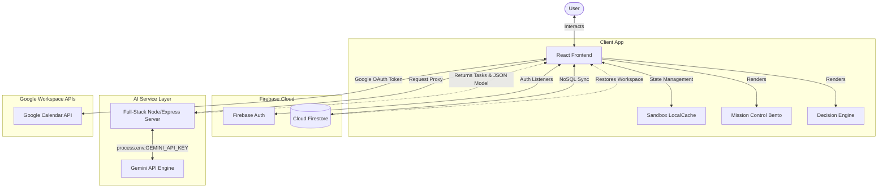
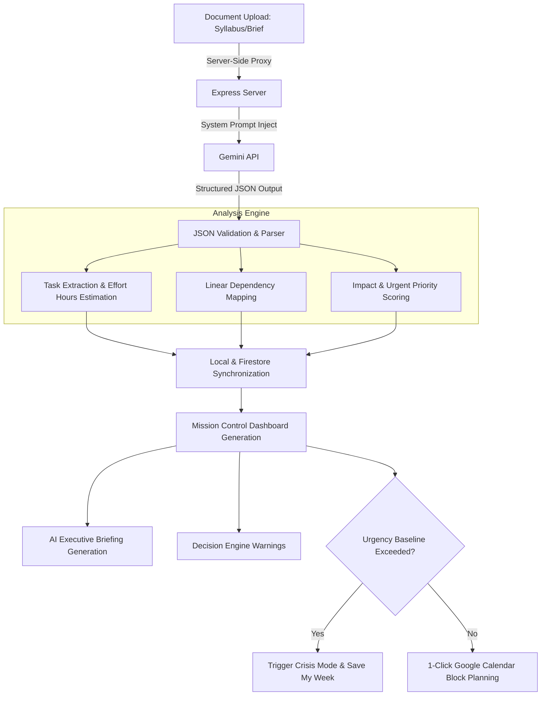

# 🛡️ DeadlineGuardian AI

### *Turn Chaos into a Calendar. Your AI Chief of Staff for High-Stakes Deliverables.*

[](https://vitejs.dev/)
[](https://react.dev/)
[](https://www.typescriptlang.org/)
[](https://tailwindcss.com/)
[](https://firebase.google.com/)
[](https://ai.google.dev/)
[](https://cloud.google.com/run)

DeadlineGuardian AI is a sophisticated full-stack document-intelligence assistant that acts as an **AI Chief of Staff** for students, researchers, and project managers. By uploading unstructured documents—such as exam syllabi, research papers, project briefs, or corporate milestones—DeadlineGuardian AI automatically extracts tasks, analyzes risk, schedules custom study/work blocks, and resolves agenda conflicts with elegant, automated Google Calendar syncing.

---

## 🔗 Live Access & Repository
* **Live Production App:** [https://ais-pre-mxxdnqtxqs2bwxcoz5uvoo-974323825678.asia-east1.run.app](https://ais-pre-mxxdnqtxqs2bwxcoz5uvoo-974323825678.asia-east1.run.app)
* **GitHub Repository:** `https://github.com/yuvrajgora10mar/DeadlineGuardian-AI` *(Configured in Google AI Studio Settings)*

---

## 🚨 The Problem Statement
In modern academia and professional environments, individuals suffer from **cognitive overload** and **deadline blindness**. Traditional task managers (like Todoist, Trello, or Jira) fail because:
1. **Manual Entry Friction:** Creating 50 structured tasks from a 20-page syllabus or a 100-page project specification is incredibly tedious.
2. **Lack of Contextual Risk Analysis:** Users do not know *which* task is the "critical path." A simple chronological list fails to account for weight, difficulty, or dependencies.
3. **Calendar Disconnection:** Standard lists sit passively on screens. They do not actively claim time blocks in your calendar, leading to last-minute cramming and missed milestones.
4. **Action Paralysis:** When confronted with multiple overlapping deadlines, users freeze because they lack an objective, real-time "survival strategy" or recovery recommendation.

---

## 💡 The Solution: DeadlineGuardian AI
DeadlineGuardian AI completely bypasses traditional list managers. Instead of relying on manual task entry, it provides a high-fidelity **document-to-schedule pipeline**:
* **AI Chief of Staff:** It acts as an active chief of staff that parses unstructured briefs, models complex schedules, handles risk-mitigation strategies, and acts as an executive decision engine.
* **Document Intelligence:** Upload any complex text document, and Gemini extracts milestones, maps out task weights, and establishes workloads.
* **Proactive Interventions:** When tasks start piling up, it alerts you with a dynamic "Crisis Mode" and a "Save My Week" tactical intervention engine.

---

## 🌟 Key Features

### 📂 1. AI Document Intelligence
Instantly upload any PDF, syllabus, doc, or project brief. The application processes the document server-side using Gemini, performing advanced information extraction. It extracts clear task titles, precise deadlines, calculated weights, estimated effort hours, difficulty ratings, and notes, completely eliminating manual entry.

### 📊 2. Mission Control Dashboard
A unified command center providing a deep visual overview of your workload. It features a modern bento-grid layout showcasing core analytics, timeline trajectories, the task critical path, active risk scores, and direct Google Calendar sync controls.

### 📝 3. Executive Briefing
An automated summary crafted daily by AI. It explains the "highest impact task," computes a real-time completion probability, raises critical risk alerts, and gives personalized productivity advice based on your current agenda and pending deliverables.

### ⚡ 4. Action Pipeline
An intuitive task list grouped and sorted by priority, urgency, and difficulty. Users can toggle status, edit parameters on-the-fly, delete milestones, and manually append custom requirements via the "Manual Task Creator."

### 🗺️ 5. Critical Path Analysis
Understands task dependencies. It visually structures milestones using linear dependency logic so you know exactly which foundational milestones must be completed to prevent downstream delays.

### 🧠 6. Executive Decision Engine
A dynamic advisory panel that continuously reviews your task progress and schedules. It flags if a task has "insufficient study time scheduled" or "high cognitive weight" and recommends exact block times.

### 🆘 7. Save My Week (Crisis Mode)
When your computed Completion Probability dips below threshold or task weights exceed a healthy baseline, DeadlineGuardian triggers **Crisis Mode**. This unlocks **Save My Week**, an algorithmically driven mitigation optimizer that identifies overlapping study sessions and offers immediate options to reschedule, de-conflict, or delegate deliverables.

### 🎮 8. Interactive Demo Mode
Judges and new users can test-drive the application immediately with zero configuration. It includes preset templates representing high-fidelity scenarios (e.g., *Stanford CS Syllabus*, *Complex Software Launch Project*, *Consulting Case Study*), complete with pre-packaged tasks, risk models, and interactive mock state updates.

### ☁️ 9. Firebase Cloud Persistence
Full real-time database persistence. For logged-in users, tasks, uploaded document metadata, mission control states, and customized configurations are safely synchronized to Cloud Firestore, ensuring no progress is lost across page reloads or different machines.

### 📅 10. Google Calendar Integration
Seamless calendar sync. Authorize via secure OAuth to push automatically computed work blocks, preparation tasks, and milestones directly into your Google Calendar as color-coded, time-allocated calendar events.

### 🔒 11. Sandbox Mode
Allows complete access to the core engine without authentication. Local storage is seamlessly utilized as a fallback database cache, enabling privacy-focused, zero-sign-in access.

### 🔄 12. Resume Workspace
When launching the app, the original sleek landing page is displayed. If a previous workspace is detected (either in Cloud Firestore or standard Sandbox cache), a prominent, intelligent **"Resume Previous Workspace"** card is presented to let users jump right back into their custom flow, balancing first-impression SaaS branding with rich persistent memory.

### 🩺 13. AI Explainability
Every extracted task and recommended schedule contains an "AI Insight" context card, showing the logic used to determine work hours, task priority, and deadline stress indicators.

### 📱 14. Responsive Design
A beautiful, highly polished, fully responsive interface optimized for ultra-wide desktop monitors, standard laptops, and touch-focused mobile devices.

---

## 🛠️ Google Technologies Used

| Google Technology | Purpose in DeadlineGuardian AI | Why it was Chosen |
| :--- | :--- | :--- |
| **Google AI Studio** | Developer Playground & API Management | Enabled rapid prototyping, temperature fine-tuning, system instruction crafting, and secure API key management for the LLM pipeline. |
| **Gemini API (`gemini-2.5-flash`)** | Core Document Intelligence Engine | Selected for its ultra-fast processing speeds, exceptional structured JSON formatting capabilities, and deep contextual reasoning over dense academic/corporate documentation. |
| **Firebase Authentication** | Secure User Sign-In | Handles reliable, 1-click Google OAuth authentication without the need for complex, vulnerable custom user credentials. |
| **Cloud Firestore** | Cloud Document Database | Chosen for its serverless real-time document synchronization, dynamic scaling, query-on-write speed, and seamless integration with client-side React apps. |
| **Google Cloud Run** | High-performance Production Hosting | Standardized deployment of our full-stack Express & Node.js application containers, delivering sub-second scale-to-zero capabilities and worldwide edge caching. |
| **Google Calendar API** | Actionable Time Scheduling | The physical engine of the de-confliction process. Instead of leaving tasks on a passive list, it pushes active study blocks directly into the user's primary daily agenda. |

---

## 📐 Architecture Diagram



---

## 🧠 AI Workflow Pipeline



---

## 💻 Technology Stack

| Layer | Technology | Details |
| :--- | :--- | :--- |
| **Frontend** | React 19 (Vite) | Main client-side rendering, reactive state management |
| **Backend** | Express, Node.js | Proxy requests, secure environment variable gateway |
| **Language** | TypeScript | Strong typing across client and server |
| **AI Engine** | Gemini API | Powered by `@google/genai` SDK |
| **Database** | Cloud Firestore / LocalStorage | Multi-tenant persistent database storage |
| **Authentication** | Firebase Authentication | Google OAuth Provider |
| **Styling** | Tailwind CSS v4 | High-contrast, modern utility class UI |
| **Animations** | Motion | Fluid bento grid and routing transitions |
| **Charts** | Recharts | Dynamic interactive completion and workload gauges |
| **Deployment** | Google Cloud Run | Fully containerized microservice execution |

---

## ⚙️ Installation & Local Setup

### Prerequisites
* Node.js v18.x or higher
* npm v9.x or higher
* A Firebase Project with Firestore and Google Sign-In enabled.
* A Gemini API Key from Google AI Studio.

### Steps
1. **Clone the Repository:**
   ```bash
   git clone https://github.com/yuvrajgora10mar/DeadlineGuardian-AI.git
   cd DeadlineGuardian-AI
   ```

2. **Install Dependencies:**
   ```bash
   npm install
   ```

3. **Configure Environment Variables:**
   Create a `.env` file in the root directory by copying `.env.example`:
   ```bash
   cp .env.example .env
   ```
   Provide your local credentials:
   ```env
   GEMINI_API_KEY="AIzaSyYourKey..."
   GOOGLE_CLIENT_ID="your-client-id.apps.googleusercontent.com"
   GOOGLE_CLIENT_SECRET="your-google-client-secret"
   ```

4. **Initialize Firebase Config:**
   The Firebase SDK will read settings from `firebase-applet-config.json` at startup. Ensure yours is correctly populated:
   ```json
   {
     "apiKey": "...",
     "authDomain": "...",
     "projectId": "...",
     "storageBucket": "...",
     "messagingSenderId": "...",
     "appId": "..."
   }
   ```

5. **Start Dev Server:**
   This boots the Express backend on port `3000` with the Vite dev server mounted:
   ```bash
   npm run dev
   ```
   Open your browser and navigate to `http://localhost:3000`.

6. **Build for Production:**
   ```bash
   npm run build
   npm run start
   ```

---

## 🔒 Environment Variables Reference

| Variable | Required? | Location | Description |
| :--- | :--- | :--- | :--- |
| `GEMINI_API_KEY` | **Yes** | Server Secrets | Authenticates with the Gemini API to parse documents. Keep hidden from frontend. |
| `APP_URL` | **Yes** | Client/Server Config | The canonical hosting URL. Used for OAuth redirects and sync callbacks. |
| `GOOGLE_CLIENT_ID` | Optional | Client OAuth | Enables real-world Google Calendar syncing. |
| `GOOGLE_CLIENT_SECRET` | Optional | Server Secrets | Secures Calendar sync requests and tokens. |

---

## 📁 Codebase Directory Structure

```text
DeadlineGuardian-AI/
├── .env.example               # Environment variables template
├── firebase-applet-config.json# Client-side Firebase SDK configuration
├── firestore.rules            # Secure access constraints for Firestore
├── metadata.json              # Platform metadata and capability declaration
├── package.json               # Full-stack node dependencies and script entry points
├── server.ts                  # Main Express backend with Vite middleware
├── tsconfig.json              # TypeScript compilation specifications
├── vite.config.ts             # Vite build pipeline and plugin declarations
├── src/                       # Main application codebase
│   ├── App.tsx                # Client core layout and state engine
│   ├── demoData.ts            # High-fidelity mock datasets for immediate trials
│   ├── index.css              # Global styles, fonts, and Tailwind v4 themes
│   ├── main.tsx               # DOM React mounting script
│   ├── types.ts               # Shared TypeScript schemas, types, and interfaces
│   ├── lib/
│   │   └── firebase.ts        # Modular Firebase initialize & persistent data queries
│   └── components/
│       ├── AnalyticsSection.tsx# Bento grid widgets for workload forecasting
│       ├── CrisisMode.tsx      # Save My Week mitigation modal
│       ├── DailyBriefing.tsx   # AI Chief of Staff morning brief
│       ├── ExtractionReport.tsx# Dynamic file analysis view
│       ├── ManualTaskModal.tsx # Custom milestone adder form
│       ├── MissionControl.tsx  # Dynamic bento layout grid
│       ├── Navbar.tsx          # Responsive navigation bar
│       ├── TaskList.tsx        # Action pipeline task controller
│       └── UploadZone.tsx      # Multi-format drag & drop document extractor
```

---

## 🖼️ Application Showcases

Here is a visual roadmap of our production layouts. Once running, you will be guided through:

1. **The Landing Page & Resume Workspace:** A beautifully minimal dark-mode portal that offers a clean hero layout, an immediate file upload zone, active quick-start demo models, and an intelligent card to restore previous workspaces seamlessly.
2. **Mission Control Bento Dashboard:** A dense, elegant data layout featuring progress rings, completion forecasts, work hour distributions, and active scheduling status indicators.
3. **AI Morning Briefing Panel:** An actionable advice card explaining exactly what needs your attention today, paired with contextual risk metrics.
4. **The Urgency Action Pipeline:** Interactive task items grouped by status. Add, edit, or delete items on-the-fly.
5. **Linear Extraction Report:** A side-by-side comparison displaying extracted milestones, estimated effort hours, and difficulty ratings derived directly from your uploaded document.
6. **Save My Week (Crisis Mode Overlay):** A high-contrast safety warning that presents optimized scheduling options when deadlines start piling up.
7. **Interactive Preset Sandbox:** Clickable datasets that load fully formed academic workloads instantly so you can test features instantly.
8. **Cloud-Sync Gateway:** Visual authentication tags that turn green when your Firestore database and Google Calendar sync is fully active.

---

## 🚀 Future Roadmap & Enhancements
* **Voice-Activated Briefing:** Utilizing Gemini TTS to read out your morning productivity brief directly.
* **Canvas Team Spaces:** Allowing multiple students to upload a shared course syllabus and synchronize joint preparation blocks.
* **Automated Syllabus Diffing:** Detect when a professor publishes an updated syllabus and highlight changed deadlines automatically.
* **Slack & Discord Notifications:** Real-time push warnings sent straight to your communication channels when critical paths are delayed.

---

## 📄 License
This project is licensed under the **MIT License**. See standard open-source formats for details.

---

## 🤝 Acknowledgements
Special thanks to:
* **Google AI Studio** for state-of-the-art developer sandboxing.
* **Google Cloud & Cloud Run** for serverless container deployment.
* **Firebase** for responsive multi-user NoSQL infrastructure.
* **Vite & Tailwind CSS** for the blazing-fast developer workflow and beautiful layouts.

---

*Made with 🛡️ by the DeadlineGuardian AI Team.*
